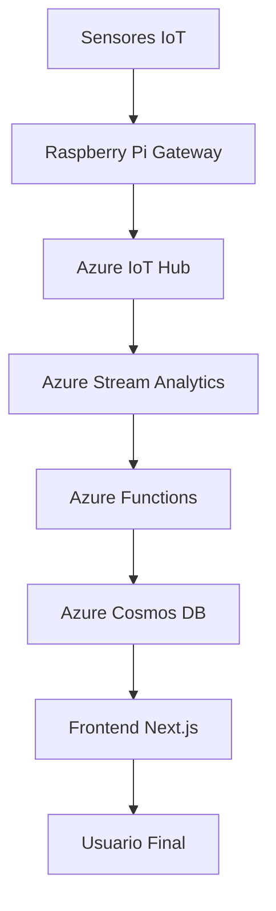

# Especificaciones Técnicas - Sistema de Riego Inteligente

## 1. Arquitectura del Sistema

### 1.1 Diagrama de Arquitectura


### 1.2 Componentes del Sistema

#### 1.2.1 Capa de Dispositivos (Edge Layer)
- **Sensores IoT**
  - Sensores de humedad del suelo (capacitivos)
    * Modelo: Capacitive Soil Moisture Sensor v1.2
    * Rango: 0-100%
    * Precisión: ±2%
    * Frecuencia de muestreo: 1/minuto
  
  - Sensores de temperatura ambiente
    * Modelo: DHT22
    * Rango: -40°C a 80°C
    * Precisión: ±0.5°C
    * Frecuencia de muestreo: 1/minuto
  
  - Sensores de nivel de agua
    * Modelo: Ultrasonic Water Level Sensor
    * Rango: 2cm-400cm
    * Precisión: ±1cm
    * Frecuencia de muestreo: 1/minuto

- **Actuadores**
  - Válvulas solenoides
    * Modelo: 12V DC Solenoid Valve
    * Presión máxima: 0.8MPa
    * Tiempo de respuesta: <1s
  
  - Bombas de agua
    * Modelo: 12V DC Water Pump
    * Caudal: 240L/h
    * Presión: 0.8MPa

#### 1.2.2 Capa de Plataforma (Azure IoT)
- **Azure IoT Hub**
  - Nivel: S1 (Standard)
  - Mensajes diarios: 400,000
  - Dispositivos: 100
  - Costo mensual estimado: $50 USD

- **Azure Stream Analytics**
  - Unidades de streaming: 1
  - Procesamiento: 1MB/s
  - Costo mensual estimado: $30 USD

- **Azure Functions**
  - Plan: Consumption
  - Ejecuciones: 1,000,000/mes
  - Memoria: 128MB
  - Costo mensual estimado: $20 USD

- **Azure Cosmos DB**
  - Nivel: Standard
  - Almacenamiento: 10GB
  - RU/s: 400
  - Costo mensual estimado: $40 USD

#### 1.2.3 Capa de Aplicación
- **Frontend (Next.js)**
  - Framework: Next.js 15.2.3
  - UI Components: Radix UI
  - Styling: Tailwind CSS
  - State Management: React Query

- **Backend (Node.js)**
  - Runtime: Node.js 18.x
  - Framework: Express.js
  - Autenticación: JWT
  - API: RESTful

## 2. Protocolos de Comunicación

### 2.1 MQTT
- Broker: Azure IoT Hub
- QoS: 1
- Topics:
  - `devices/{deviceId}/messages/events`
  - `devices/{deviceId}/messages/devicebound`
  - `devices/{deviceId}/twin/update`

### 2.2 HTTPS
- Endpoints REST
- Autenticación: JWT
- Rate Limiting: 100 requests/min

### 2.3 LoRaWAN
- Frecuencia: 915MHz
- Potencia: 14dBm
- Rango: 2-5km

## 3. Formatos de Datos

### 3.1 Telemetría
```json
{
  "deviceId": "string",
  "timestamp": "ISO8601",
  "sensors": {
    "soilMoisture": "number",
    "temperature": "number",
    "waterLevel": "number"
  },
  "actuators": {
    "valveStatus": "boolean",
    "pumpStatus": "boolean"
  }
}
```

### 3.2 Comandos
```json
{
  "commandId": "string",
  "deviceId": "string",
  "timestamp": "ISO8601",
  "action": "string",
  "parameters": {
    "duration": "number",
    "intensity": "number"
  }
}
```

## 4. Requisitos de Seguridad

### 4.1 Autenticación
- Certificados X.509 para dispositivos IoT
- JWT para API REST
- Azure AD para usuarios

### 4.2 Encriptación
- TLS 1.2 para comunicaciones
- AES-256 para datos en reposo
- RSA-2048 para firmas digitales

### 4.3 Autorización
- RBAC (Role-Based Access Control)
- Roles: Admin, Farmer, Viewer
- Permisos granulares por campo

## 5. Costos Estimados

### 5.1 Hardware por Unidad
- Raspberry Pi 4: $35 USD
- Sensores: $50 USD
- Actuadores: $30 USD
- Power Supply: $40 USD
- Total: $155 USD

### 5.2 Servicios Azure (Mensual)
- IoT Hub: $50 USD
- Stream Analytics: $30 USD
- Functions: $20 USD
- Cosmos DB: $40 USD
- Total: $140 USD

### 5.3 Desarrollo y Mantenimiento
- Desarrollo inicial: $15,000 USD
- Mantenimiento mensual: $1,000 USD
- Soporte técnico: $500 USD/mes

## 6. Plan de Implementación

### Fase 1: Configuración Base (2 semanas)
- Configuración de hardware
- Instalación de software base
- Conexión con Azure IoT Hub

### Fase 2: Desarrollo Core (2 semanas)
- Implementación de lógica de control
- Desarrollo de algoritmos de riego
- Pruebas de campo iniciales

### Fase 3: Integración y Optimización (2 semanas)
- Integración con plataforma web
- Optimización del sistema
- Documentación técnica

## 7. Métricas de Éxito

### 7.1 Técnicas
- Latencia < 100ms
- Disponibilidad > 99.9%
- Precisión de sensores > 95%

### 7.2 Negocio
- Reducción de consumo de agua > 30%
- ROI > 200% en 12 meses
- Satisfacción de usuario > 90% 


Creo que en ese sentido el profesor sugiere que especifiquemos qué sensores se usarían para medir humedad, nivel de agua, temperatura, etc... Y cómo se conectarían esos sensores a la página web, para mostrar los datos en pantalla